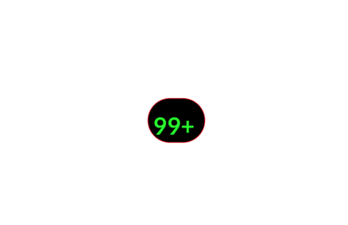
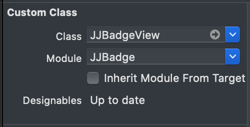

# JJBadge

Simple Badge


[](https://cocoapods.org/pods/JJBadge)
[](https://cocoapods.org/pods/JJBadge)
[](https://cocoapods.org/pods/JJBadge)


## Requirements
```
IOS Deployment Target 12.0+  
```
## Installation


JJBadge is available through [CocoaPods](https://cocoapods.org). To install
it, simply add the following line to your Podfile:

```ruby
pod 'JJBadge'
```

## Example

To run the example project, clone the repo, and run `pod install` from the Example directory first.


## Preview



## Creating a badge in the Storyboard

* Drag a UIView to your view.
* Set its class to JJBadgeView in identity inspector.
* Set the module property to JJBadge 



## Creating a badge from the code
```Swift
 import JJBadge

 let badge = JJBadgeView()
 view.addSubview(badge)
```


## Customization

| Name | description | type | default |
| --- | --- | --- | --- |
| setText | set the text | String | "99+" |
| setTextSize | Set the text size | CGFloat | 15 |
| setFont | name  sample: ("Roboto")  | String | System Font |
| setTextColor | Set a color for the text | UIColor | white |
| setStrokeColor | Set a color for the stroke | UIColor | black |
| setStrokeWidth | Set a width for the stroke | CGFloat | 0 |
| setIsTextHidden | Make text visible or hidden | Bool | false |
| setTextOffsetX | move the text - axis X | CGFloat | -0 |
| setTextOffsetY | move the text - axis Y  | CGFloat | -0 |
| setInsetX | wrapContent inset axis X | CGFloat | -0 |
| setInsetY | wrapContent inset axis Y  | CGFloat | -0 |
| setBackgroundColor | backgroundColor  | UIColor | red |


## Size 

using constraints

| Name | description | equal 
| --- | --- | --- |
| width | undefined  | Wrap Content |
| height | undefined | Wrap Content |
